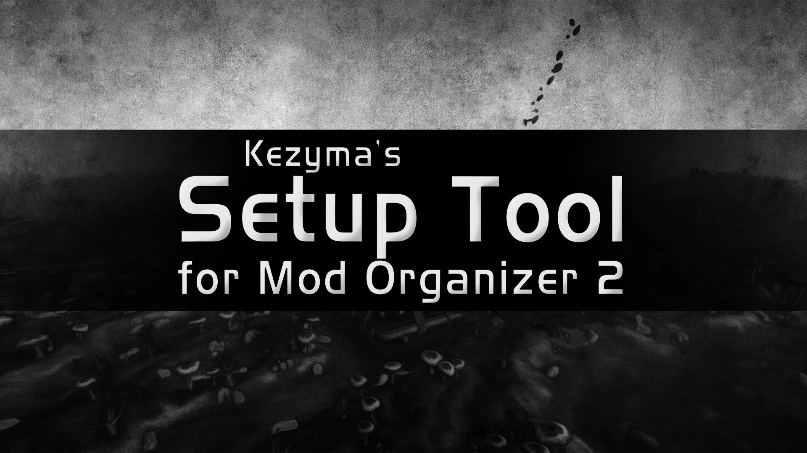

A tool that allows quick deployments of Mod Organizer, with options to install additional plugins, configure the instance, and support creating Wabbajack modlists.

This setup tool will download Mod Organizer and any of the optional plugins, install Mod Organizer to the specified folder, and optionally pre-configure it for a specific game. It can also create a stock game folder and generate meta files for all the downloads to support development of Wabbajack modlists.

- [Settings](#settings)
- [Command Line Arguments](#command-line-arguments)

## Settings

- **Stock Game** — Copies the selected game to a folder in Mod Organizer called `game`, used for creating completely portable setups or with Wabbajack lists.
- **Portable Setup** — Configures Mod Organizer to run as a portable instance with the selected game. If Stock Game is enabled, it will be configured to run with the copy.
- **Keep Installers** — Saves the downloaded installers to reduce install time if setting up multiple Mod Organizer installations.
- **Wabbajack** — Copies all the downloaded installers to the Mod Organizer downloads directory and generates meta files for them, used if creating Wabbajack lists.
- **Nexus API Key** — If a premium NexusMods API key is provided, installers will be sourced from NexusMods instead of GitHub.

## Command Line Arguments

This tool can also be run with arguments to configure specific settings or automatically run an install. The following arguments are supported.

| Argument | Description |
|----------|-------------|
| `-portable` | Configure as a portable instance (requires a game path). |
| `-stockgame` | Make a stock game folder (requires a game path). |
| `-cleanup` | Delete all downloads after installing. |
| `-wj` | Copy installers to downloads and generate meta files for them. |
| `-run` | Automatically start the install. |
| `-mo:"x"` | Specify the version of Mod Organizer to install. |
| `-ip:"x"` | Specify the path to install Mod Organizer to. |
| `-gp:"x"` | Specify the path to the game. |
| `-nk:"x"` | Specify a premium NexusMods API key. |
| `-rb` | Install [Root Builder](https://www.nexusmods.com/skyrimspecialedition/mods/31720). |
| `-ps` | Install [Profile Sync](https://www.nexusmods.com/skyrimspecialedition/mods/60690). |
| `-pf` | Install [Plugin Finder](https://www.nexusmods.com/skyrimspecialedition/mods/59869). |
| `-sc` | Install [Shortcutter](https://www.nexusmods.com/skyrimspecialedition/mods/59827). |
| `-ri` | Install [Reinstaller](https://www.nexusmods.com/skyrimspecialedition/mods/59292). |
| `-op` | Install [OpenMW Player](https://www.nexusmods.com/morrowind/mods/52345). |
| `-cc` | Install [Curation Club](https://www.nexusmods.com/skyrimspecialedition/mods/60552). |
